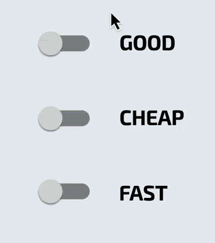

# good_cheap_fast

A Flutter beginner challenge

## Challenge Rules:
1. Create project requirements for this one page app (the GIF below). This needs to be able to describe the behavior of the widgets perfectly so that no questions need to be asked in order to complete it.
2. Write out a technical plan for how you plan to structure it.
3. Create the app, and post a github link to it on this thread. Make sure the Readme has step 1 in it.
Bonus: Upload it to github pages or other hosting so we can see it in action without having to compile it. If you can't get this step, record a GIF and put it as part of the Readme.

Rules. You cannot look at how others have completed theirs in order to make yours. The whole purpose of the exercise is to experience the entire process yourself. Happy coding!

## My Project Description:

* Design a single screened app with three switches.
* Each switch will be connected with the others. Only 2 switches can be
on at the same time. Turning on a third will turn off another switch chosen at random.

* The switches need to be green, blue, and red respectively.
* They should be centered and evenly spaced.
* The words GOOD, CHEAP, and FAST should be next to the switches, one word per switch.

Original example

My version
